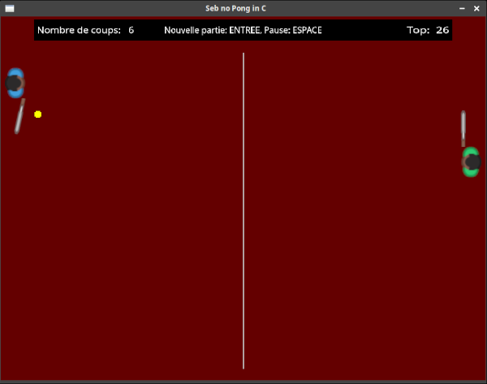

## Pong no Seb in C

par Sébastien Abilla

MIT License (voir LICENSE)

### C'est quoi?

Mon premier jeu. Pas très beau, mais fonctionnel?  
C'est un Pong-like game (Allan Alcorn, 1972) développé en C avec la SDL.  
Dans "Pong no Seb in C", il faut essayer de faire le plus long échange possible.  
Jouable au clavier ou à la manette. 

 

### Infos pour le compiler

Développé dans l'éditeur Geany 1.37.1 et testé sous Xubuntu 21.10 64 bits.  

Pour pouvoir compiler, il faut avoir installé:

```bash
libsdl2-dev
libsdl2-mixer-dev
libsdl2-ttf-dev
```

puis entrer dans un terminal:

```bash
gcc *.c -o pong -lm -lSDL2_ttf -lSDL2_mixer $(sdl2-config --cflags --libs)
```

### Crédits

De nombreuses parties du code sont adaptées ou inspirées de:
* CS50x by David J. Malan https://cs50.harvard.edu/x/2021
* FormationVideo - C cours by Jason Champagne https://www.youtube.com/c/Formationvidéo8/

Les sons sont extraits et/ou adaptés de:
* Freesound - Table tennis sounds by JJDG.mp3 https://freesound.org/people/JJDG/sounds/441799/
* Freesound - Milan Derby (Milan vs Inter) at San Siro Stadium.mp3 https://freesound.org/people/neilraouf/sounds/424354/
* Freesound - "Retro Death" by BrickDevelopper171.mp3 https://freesound.org/people/BrickDeveloper171/sounds/610281/

Les sprites sont adaptés de:
* kenney_sportsPack.zip https://opengameart.org/content/sports-pack-350


